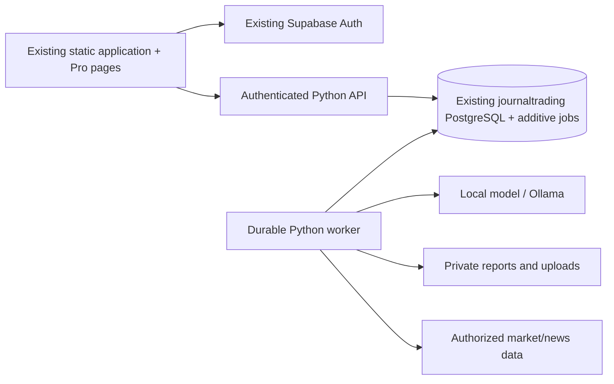

# Pro implementation plan

Baseline and findings: `docs/pro-phase-0-audit.md`. Keep current static frontend and Supabase identity/journal. Add one Python API plus a worker sharing deterministic analytics. Use Postgres transactional jobs rather than another queue service. Privileged worker credentials remain server-only. Browser sends its existing Supabase access token; API verifies it against the correct Auth service. New pages inherit the current shell.

## Decisions

Reuse native frontend, existing auth and four public core tables. No new SPA framework, design system, replacement auth or unrelated refactor. A separate Python runtime is necessary for local inference; Pages remains presentation only. Use NUMERIC/Decimal financial calculations and documented unknown states. Trade PnL must come from recorded net values or validated executions/specifications, never guessed from a symbol. Postgres row locks and idempotency constraints provide shared quotas across workers. Missing credentials/model/data returns an explicit unavailable state and does not consume AI usage.

## Ordered slices and acceptance

0. Audit and baseline (complete): correct project, schema/RLS/read-only advisor evidence and baseline tests.
1. Entitlements and jobs: additive migrations; active/cancelled-through-period-end/expired plans; monthly annual quota windows; one-unit concurrent reservation test; owner isolation and no direct protected writes. Verify in a local database, never migrate production during implementation.
2. Navigation/routes: disabled noninteractive Free/Plus hook; ten server-verified Pro entries, direct URL guards; responsive existing shell unchanged. Verify browser desktop/mobile and logout/expiry.
3. Imports/Plus: successful rolling-12h commits, idempotent duplicate handling, file validation/private upload, regional/country restrictions. Keep legacy local journal available; separate deployment-dependent delivery changes for approval.
4. Deterministic Pro: analytics, heatmap, strategy CRUD/comparison, risk calculator/rules/evidence, weekly/monthly persisted reviews. Verify actual database trade fixtures with fees/partial executions/timezones/empty datasets, date/account filters and drilldown.
5. PDF: actual background PDF, report config/preview/history/retry/delete/signed download, 3-job concurrency and rate limits. Verify file bytes and owner denial; Storage integration separately marked until available.
6. Local AI infrastructure: durable queue/lease recovery/cancellation, private local model endpoint, schema validation, health/model-version/license docs. Verify unavailable model/failure release and runnable CPU paths; actual benchmark only with installed permitted model.
7. Behaviour/journal AI: evidence from deterministic owner-scoped metrics, shared quota confirmation/history/retry, no invented observations/psychological diagnoses.
8. Market AI: TradingView symbol/timeframe integration plus separately authorized data, indicators/macro/source/freshness/scenarios; unavailable sources block inference without quota charge.
9. Global news/calendar: backend entitlement/country filtering/search/date/category/deduplication/attribution; no International bypass. Preserve existing Economic news name and appearance.
10. Traceability and integration: document every new control in `docs/UI_BACKEND_TRACEABILITY.md`; real browser to local API/database workflow plus unit tests; clearly distinguish transport fakes from provider proof.
11. Security/regression/performance: owner and role tests, quota races, invalid/duplicate webhooks, XSS/SSRF validation, baseline shell/journal/calculator/news/auth tests, bounded job/filter behavior, documented backup/retention/deployment.

External approval checkpoint: present concrete migrations, deployment settings, provider/model requirements and test evidence before production deployment, changing public feed delivery, or activating billing. Missing runtime/provider integrations remain Blocked. No paid plan activation from frontend success. No silent phase skips.
